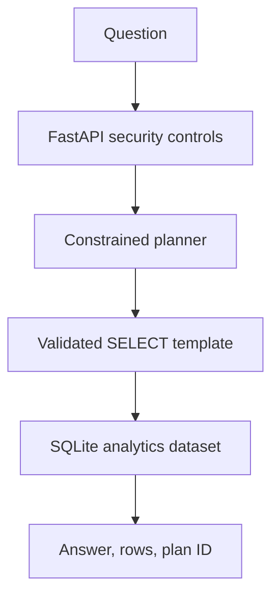

# Enterprise Text-to-SQL Agent

[](https://github.com/krishna-theja-nooka/enterprise-text-to-sql-agent/actions/workflows/ci.yml)

A Python-first, production-minded natural-language analytics API. It converts approved business questions into **constrained, parameterized, read-only SQL plans** over a synthetic fleet-contract dataset.

> This is intentionally not a demo that executes arbitrary LLM-generated SQL. It demonstrates the safer control plane needed before introducing an LLM in an enterprise analytics workflow.

## Why this project matters

Text-to-SQL is useful, but unrestricted SQL generation creates security and reliability risks. This project shows how to build a safe first version:

- reviewed, allow-listed query plans instead of raw SQL from the client;
- parameterized SQLite queries and read-only SQL validation;
- API-key authentication and basic rate limiting;
- audit records for successful and rejected requests;
- deterministic evaluation cases run in CI;
- FastAPI interactive documentation at `/docs`.

## Architecture



See [architecture notes](docs/ARCHITECTURE.md) and the [security model](docs/SECURITY.md) for the detailed design.

## Supported questions

The application deliberately supports a small, explicit analytics catalog:

| Example question | Plan ID |
| --- | --- |
| `How many completed contracts were there in 2026-03?` | `completed_contracts_by_month` |
| `How many active contracts does Northstar Logistics have?` | `active_contracts_by_customer` |
| `Show the contract breakdown by status` | `contracts_by_status` |
| `Show the top customers by contract value` | `top_customers_by_value` |
| `What is the average contract value by vehicle category?` | `average_value_by_category` |

Questions outside this catalog safely return a rejection message instead of guessing or executing unreviewed SQL.

## Quick start (Windows PowerShell)

```powershell
git clone https://github.com/krishna-theja-nooka/enterprise-text-to-sql-agent.git
cd enterprise-text-to-sql-agent
py -3.12 -m venv .venv
.\.venv\Scripts\python.exe -m pip install --upgrade pip
.\.venv\Scripts\python.exe -m pip install -r requirements.lock
.\.venv\Scripts\python.exe -m pip install --no-deps -e .
.\.venv\Scripts\python.exe -m enterprise_sql_agent init-env
.\.venv\Scripts\python.exe -m enterprise_sql_agent seed
```

If PowerShell blocks virtual-environment activation, continue using `.\.venv\Scripts\python.exe`; activation is optional.

Ask a question:

```powershell
.\.venv\Scripts\python.exe -m enterprise_sql_agent ask "How many completed contracts were there in 2026-03?"
```

Start the API:

```powershell
.\.venv\Scripts\python.exe -m enterprise_sql_agent serve
```

Open `http://127.0.0.1:8000/docs`. Use the value of `SQL_AGENT_API_KEY` from your local `.env` file as the `x-api-key` header for `POST /v1/analytics`.

## Example API request

```powershell
$key = (Select-String -Path .env -Pattern '^SQL_AGENT_API_KEY=').Line.Split('=')[1]
Invoke-RestMethod -Method Post `
  -Uri http://127.0.0.1:8000/v1/analytics `
  -Headers @{ "x-api-key" = $key } `
  -ContentType "application/json" `
  -Body '{"question":"How many completed contracts were there in 2026-03?"}'
```

Example response shape:

```json
{
  "answer": "Counts completed contracts in 2026-03.",
  "plan_id": "completed_contracts_by_month",
  "rows": [{"completed_contracts": 3}],
  "confidence": "high"
}
```

## Quality checks

```powershell
.\.venv\Scripts\python.exe -m ruff check .
.\.venv\Scripts\python.exe -m ruff format --check .
.\.venv\Scripts\python.exe -m pytest -q
.\.venv\Scripts\python.exe -m enterprise_sql_agent evaluate --output reports/evaluation.json
```

The GitHub Actions workflow runs these checks on Python 3.11 and 3.12 and uploads the evaluation report as an artifact.

## Project structure

```text
src/enterprise_sql_agent/   FastAPI service, planning, validation, database, CLI
tests/                      Unit and API tests
eval/                       Deterministic evaluation dataset
docs/                       Architecture, security, and evaluation notes
data/                       Synthetic-data documentation
.github/workflows/          GitHub Actions CI
```

## Production roadmap

1. Replace the rule-based planner with an LLM that returns a structured plan ID and typed arguments.
2. Keep the allow-list and server-side validation as non-negotiable controls.
3. Add user identity, tenant-aware row-level controls, and a managed database read replica.
4. Send audit events, latency, rejection rate, and evaluation metrics to central observability.
5. Add prompt-injection and authorization test suites before expanding the plan catalog.

## Data and security

All included data is fictional and deterministic. Never commit `.env`, real customer data, credentials, or direct database connection strings. Read [SECURITY.md](docs/SECURITY.md) before extending data access.

## License

MIT. See [LICENSE](LICENSE).
