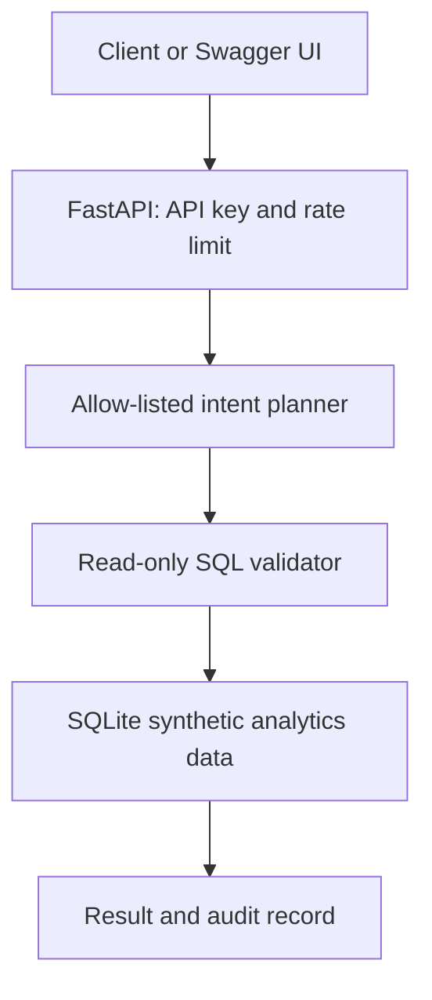

# Architecture

The API accepts a natural-language analytics question and maps it to one of a small set of approved query plans. A plan has fixed SQL and parameter values; user input never becomes executable SQL.

## Why constrained Text-to-SQL?

An unrestricted LLM emitting SQL can read unintended data, modify data, or produce unreliable answers. This repository demonstrates a safer enterprise baseline:

- fixed, reviewed SQL templates;
- parameter binding for dates and customer names;
- read-only `SELECT` validation;
- row limits and API rate limiting;
- an audit log with timestamp, plan ID, and outcome;
- evaluation cases for known business questions.

An LLM can later be introduced only as a planner that emits a structured plan ID and arguments. The server must still validate the plan and use reviewed SQL templates.
